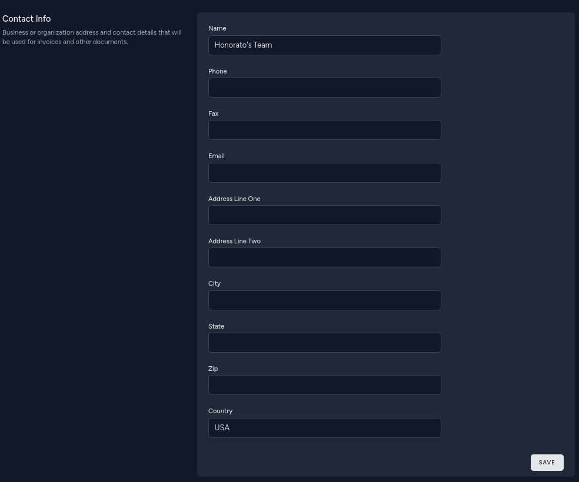

# Platform

[](https://packagist.org/packages/envor/platform)
[](https://github.com/envor/platform/actions?query=workflow%3Arun-tests+branch%3Amain)
[](https://github.com/envor/platform/actions?query=workflow%3A"Fix+PHP+code+style+issues"+branch%3Amain)
[](https://packagist.org/packages/envor/platform)

Configure your platform

## Installation

You can install the package via composer:

```bash
composer require envor/platform
```

You can publish the config file with:

```bash
php artisan vendor:publish --tag="platform-config"
```

This is the contents of the published config file(s):

```php
// config/database.php
return [
        /*
    |--------------------------------------------------------------------------
    | Default Database Connection Name
    |--------------------------------------------------------------------------
    |
    | Here you may specify which of the database connections below you wish
    | to use as your default connection for all database work. Of course
    | you may use many connections at once throughout the application.
    |
    */

    'platform' => env('PLATFORM_DB_CONNECTION', 'sqlite'),
    'default' => env('DB_CONNECTION', 'sqlite'),
];

// config/auth.php
return [
    'passwords' => [
        'users' => [
            'provider' => 'users',
            'table' => 'password_reset_tokens',
            'connection' => env('PLATFORM_DB_CONNECTION', 'sqlite'),
            'expire' => 60,
            'throttle' => 60,
        ],
    ],
];

// config/platform.php

return [
    'landing_page_disk' => env('LANDING_PAGE_DISK', 'public'),
    'profile_photo_disk' => env('PROFILE_PHOTO_DISK', 'public'),
    'stores_contact_info' => env('STORES_CONTACT_INFO', true),
    'empty_logo_path' => 'profile-photos/no_image.jpg',
    'empty_phone' => '(_ _ _) _ _ _- _ _ _ _',
    'empty_fax' => '(_ _ _) _ _ _- _ _ _ _',
    'logo_path' => env('PLATFORM_LOGO_PATH'),
    'name' => env('PLATFORM_NAME'),
    'phone' => env('PLATFORM_PHONE_NUMBER'),
    'fax' => env('PLATFORM_FAX_NUMBER'),
    'street_address' => env('PLATFORM_STREET_ADDRESS'),
    'city_state_zip' => env('PLATFORM_CITY_STATE_ZIP'),
    'email' => env('PLATFORM_EMAIL'),
];

// config/session.php

<?php

return [
    'connection' => env('PLATFORM_DB_CONNECTION'),
];

```

## Usage

### Using the platform connection

Add the trait `Envor\Platform\UsesPlatformConnection` to your model:

```php
class Business extends Model
{
    use \Envor\Platform\UsesPlatformConnection;
}
```

### Using Platform UUID's

Add the `uuid` column to your model's table in a migration:

```php
$table->uuid('uuid')->index()->unique();
```

Add the trait `Envor\Platform\UsesPlatformUuids` to your model:

```php
class Business extends Model
{
    use \Envor\Platform\HasPlatformUuids;
}
```


### Logos

Allows a model to have a logo, which can be updoaded, deleted and replaced by the user.

1. Add `profile_photo_path` (string) field to your model's database table

```php
$table->text('profile_photo_path')->nullable();
```

2. Add `\Envor\Platform\HasProfilePhoto` trait to your model.

It can be any model but we will use the user model as an example.

```php

...
class User extends Authenticatable
{
    ...
    use \Envor\Platform\HasProfilePhoto;
    ...
}
```

Usage example

```php
$user->updateProfilePhoto($request->file('photo'));
```

```blade
profile_photo_url }}" alt="{{ $user->name }}" class="rounded-full h-20 w-20 object-cover">
```

3. Use the form (optional)

> [!NOTE]  
> Requires livewire/volt and tailwind.

```bash
composer require livewire/volt
```

```bash
php artisan volt:install
```

Now you can add the form to any view:

```blade
@livewire('update-logo-form', ['model' => auth()->user()])
```

Screenshot:


### Landing Pages

Allows a model to have an html "landing page", which can be uploaded, deleted and replaced by the user.

1. publish and run migration

This will create a `landing_pages` table where landing page paths and relationship info will be stored.

```bash
php artisan vendor:publish --tag='platform-migrations'
```

```bash
php artisan migrate
```

2. Add `\Envor\Platform\HasLandingPage` trait to your model.

It can be any model but we will use the user model as an example:

```php

...
class User extends Authenticatable
{
    ...
    use \Envor\Platform\HasLandingPage;
    ...
}
```

Usage example

```php
$user->updateLandingPage($request->file('landing-page'));
```

```blade
<a href="{{ $user->url }}">Visit Landing Page</a>
```

3. Use the form (optional)

> [!NOTE]  
> Requires livewire/volt and tailwind.

```bash
composer require livewire/volt
```

```bash
php artisan volt:install
```

Now you can add the form to any view:

```blade
@livewire('update-landing-page-form', ['model' => auth()->user()])
```

Screenshot:


4. Make The landing page the home page (optional)

In this example we will illustrate how it might be done for a user which has a `domain` property.

Add domain field to users table in a migration:

```php
$table->string('domain')->nullable();
```

Then show the page on the home '/' route:

```php
use Illuminate\Http\Request;

Route::get('/', function (Request $request) {

    $user = \App\Models\User::where('domain', $request->getHost())->first();

    if ($user?->landing_page) {
        return response()->file(Storage::disk($user->landingPageDisk())->path($user->landingPagePath()));
    }

    return view('welcome');

})->name('home');

```

### Contact Info

Allows a model to have address and other contact details

1. Add contact data text (or json) field to your model's database table

```php
$table->text('contact_data')->nullable();
```

2. Add `\Envor\Platform\HasContactData` trait to your model.

It can be any model but we will use the user model as an example:

```php
...
class User extends Authenticatable
{
    ...
    use \Envor\Platform\HasContactData;
    ...
}
```

Usage example

```php
$user->updateContactData([
    'name' => 'Jane Doe',
    'address' => [
        '1234 somewhere lane'
    ];
]);
```

3. Use form (optional)

> [!NOTE]  
> Requires livewire/volt and tailwind.

```bash
composer require livewire/volt
```

```bash
php artisan volt:install
```

Now you can add the form to any view:

```blade
@livewire('update-contact-info-form', ['model' => $user, 'readonly' => $user->id != auth()->id()])
```

Screenshot:



## Testing

```bash
composer test
```

## Changelog

Please see [CHANGELOG](CHANGELOG.md) for more information on what has changed recently.

## Contributing

Please see [CONTRIBUTING](CONTRIBUTING.md) for details.

## Security Vulnerabilities

Please review [our security policy](../../security/policy) on how to report security vulnerabilities.

## Credits

- [inmanturbo](https://github.com/envor)
- [All Contributors](../../contributors)

## License

The MIT License (MIT). Please see [License File](LICENSE.md) for more information.
